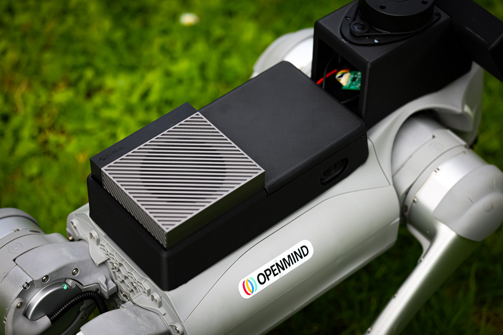
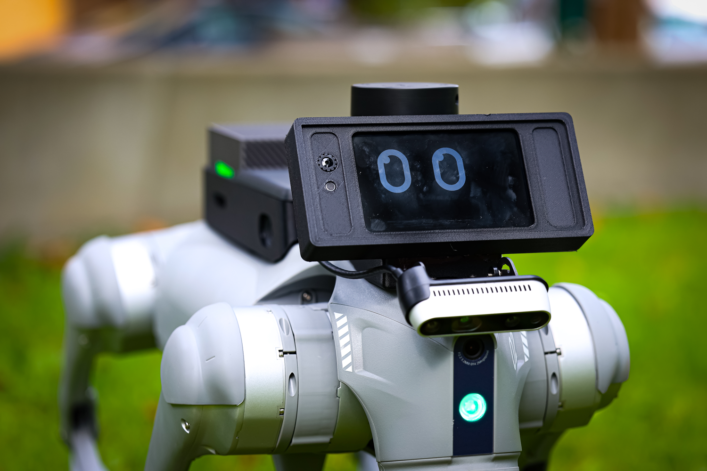

## Basic Introduction

- From research to real-world autonomy, the **OM1 BrainPack** is a plug-and-play module that brings full autonomy to your robots.
- It is designed to be mounted directly onto a robot to provide a platform that integrates **compute, battery power, and optimized efficiency** with OM1.
- The BrainPack makes your robot smarter — a system that **learns, moves, and builds with you.**
- These BrainPacks provide Nvidia AGX or Thor to Unitree dogs and humanoids. Each of them comes with on open reference design, speakers, and connectivity to other sensors via Ethernet and USB, with multiple power options. 
- The BrainPack supports modern and future Nvidia hardware and software (JetPack 6.2 etc), current and future versions of ROS2, and are robot agnositcs, and control different form factors.

## Next steps
We'll shortly be releasing the **BOM** so that you can build your own BrainPack and details on **DIY** guideline for it. 
Stay tuned!