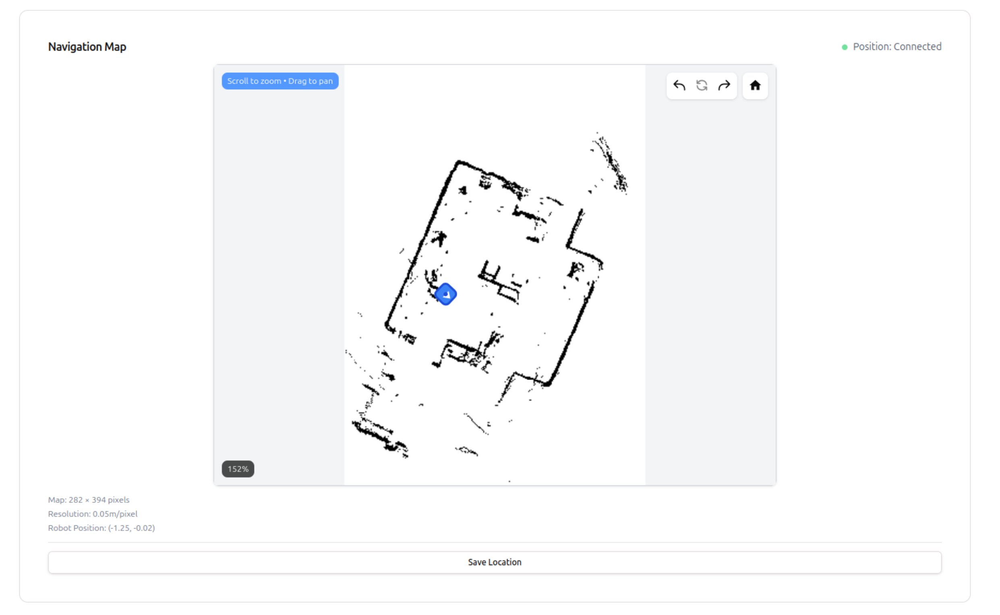
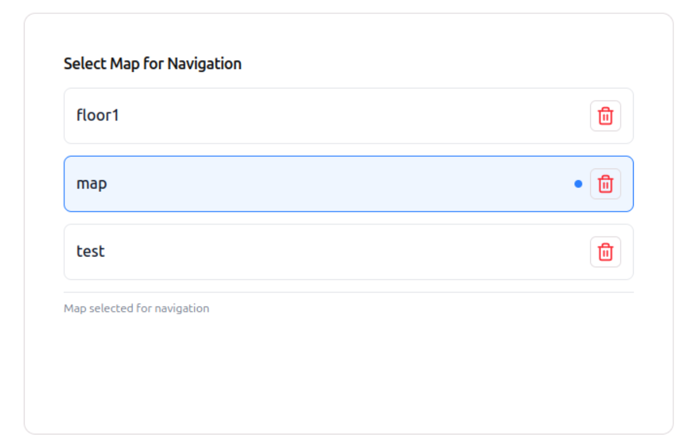

Once your Go2 is setup to run in full autonomy, you can get started with exploring different modes offered via OM1 and explore the functionalities.
There are two ways to do this:
1. Voice commands
2. Via Portal

## Voice commands

Step 1: Configure your API key in ~/.bashrc file and start your machine in full autonomy mode.
Step 2: Start talking to your robot dog and ask it to switch to a particular mode.
    For example, 
    The robot says, hi I'm your friendly robot dog, how may I help you?
    The user can then request the robot to switch to a particular mode by saying, switch to [desired mode].

- Desired mode: **Welcome** 
    trigger_keywords: ["reset", "start over", "welcome mode", "restart", "initialize"]
- Desired mode: **Conversation** 
    trigger_keywords: ["talk", "chat", "conversation", "tell me", "ask you", "discuss"]
- Desired mode: **Slam** 
    trigger_keywords: ["explore", "map", "navigate", "look around", "slam", "wander"]
- Desired mode: **Navigation** 
    trigger_keywords: ["navigate", "navigation", "go to", "take me to", "show me"]
- Desired mode: **Guard** 
    trigger_keywords: ["guard", "security", "patrol", "keep watch"]

## Portal

Step 1: Configure your API key in ~/.bashrc file and start your machine in full autonomy mode.
Step 2: Login to your OM1 portal and head over to Machine Teleops on the left navigation bar.
    
Step 3: You'll now be able to see your machine online on top of the screen.
    
Step 4: If you scroll down, you can choose the mode, you want your robot to switch to, as per preference.
    
Step 5: If you're in the slam mode, you can walk the obot sround and generate a map. Along the way you can tell the robot which area it is in at the moment, and ask it to remember. The map should look like this -
    
Step 6: Once the map is saved, you can now switch to navigation mode and make the robot move across the area by selecting the options available in the drop down.
    
Step 7: You can also watch 3 different camera streams on your portal.
    

These steps and exploration methods provide a structured approach to understanding and managing OM1’s modes.